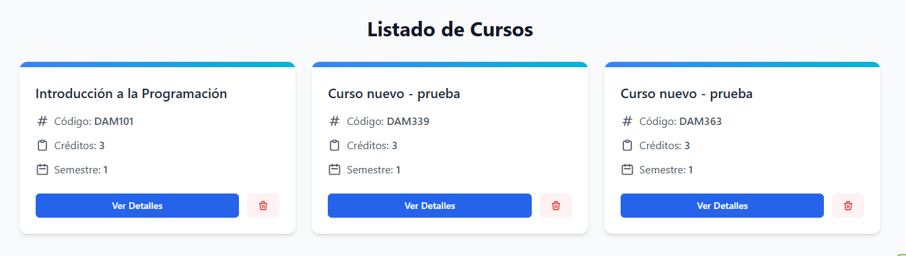
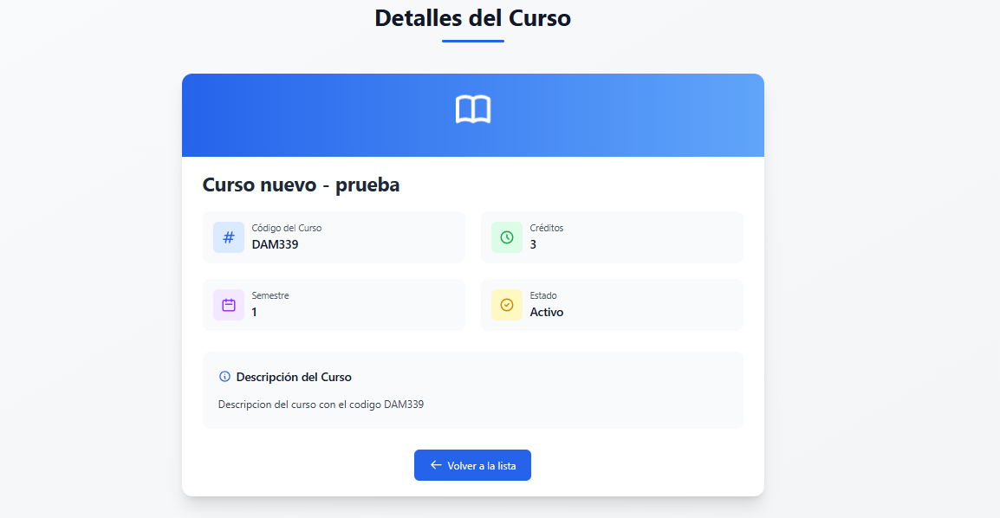
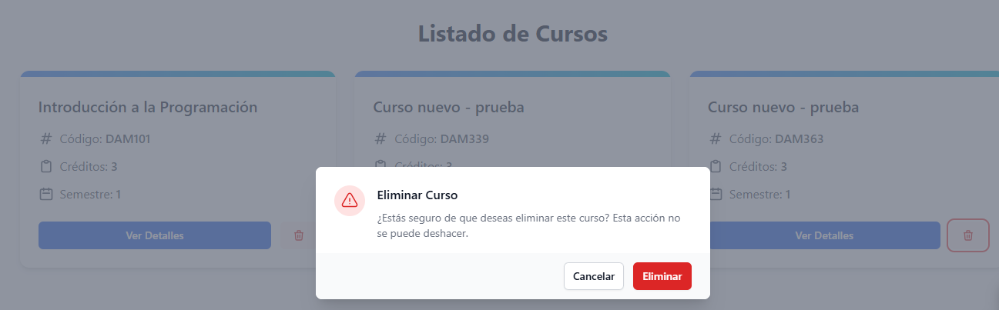

# 📘 App Web de Gestión de Cursos 📘

**Practica #4 | Asignatura: Programacion web**

## 🎯 Objetivo del Proyecto

Desarrollar una aplicación web que facilite la gestión de cursos académicos. Esta aplicación permite realizar operaciones como la creación, visualización, edición y eliminación de registros de cursos.

Está diseñada con una estructura escalable y amigable para ser utilizada en un ambiente educativo o administrativo.

**📌 Nota**: Este proyecto fue desarrollado para practicar habilidades en el desarrollo de aplicaciones web con Node.js, Express y Handlebars.

---

## 🚀 Funcionalidades Principales

1. 📋 **Lista de Cursos**: Visualización de todos los cursos registrados.
2. ➕ **Agregar Curso**: Permite registrar un nuevo curso con información como título, descripción y duración, mediante la herramienta Postman con el metodo POST.
3. ✏️ **Editar Curso**: Modifica los detalles de un curso existente por su ID.
4. ❌ **Eliminar Curso**: Opción para eliminar cursos de la lista.
5. 🔍 **Buscador de Cursos**: Búsqueda rápida de curso por su ID mediante la URL. Por ejemplo: http://localhost:5000/cursos/DAM339
6. 📄 **Vista de Curso Detallada**: Despliega toda la información sobre un curso que el usuario halla seleccionado.

---

## 📸 Capturas de Pantalla

Aquí se muestra una lista de todas las pantallas desarrolladas para esta aplicación:

🏠 **Pantalla Principal** | Muestra el listado de todos los cursos.



📘 **Pantalla de Detalle** | Información detallada de un curso específico.



📘 **Pantalla de Eliminar Curso** | Notificacion para eliminar curso



## 🗂️ Estructura de Archivos

- bin/: Configuración del servidor.
- data/: Almacenamiento de datos o configuración.
- public/stylesheets/: Archivos CSS para la interfaz.
- routes/: Define las rutas principales de la aplicación.
- views/: Plantillas de Handlebars para el frontend.
- app.js: Punto de entrada de la aplicación.
- package.json: Información de dependencias y scripts.

## 👥 Equipo de Desarrollo

- **Luis Manuel C.** (Líder del Proyecto)

---

## 🛠️ Inicialización del Proyecto

### 📋 Requisitos Previos

1. **Node.js** (versión 14 o superior).
2. **npm** (gestor de paquetes de Node.js).

Asegúrate de tener todas las dependencias necesarias ejecutando el siguiente comando:

```bash
node -v && npm -v
```

## 📝 Pasos de Inicialización

1. Descargar el Proyecto: Clona el repositorio o descarga el proyecto desde GitHub.

```bash
git clone https://github.com/luismanuelcldev/AppWeb-GestionDeCursos.git
cd AppWeb-GestionDeCursos
```

2. Instalar Dependencias: Deberas ejecutar el siguiente comando para instalar las dependencias.

```bash
npm install
```

3. Iniciar el Servidor: Una vez completados los pasos anteriores, inicia el servidor con:

```bash
npm start
```

---
